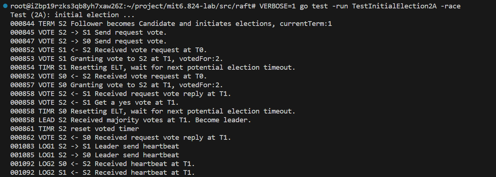
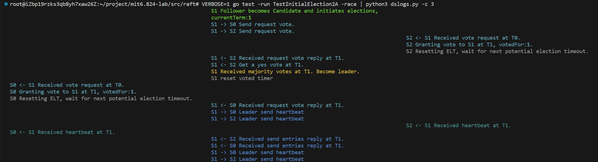

# mit8.5840 - lab
* 本仓库是 mit 8.5840 分布式系统 配套 lab 的实现
* 课程主页: https://pdos.csail.mit.edu/6.824/schedule.html

## Current progress
* lab1
  * 相关 commit: https://github.com/warr99/mit6.824-lab/commit/f11167b2989681e88ff8979bed9c26ba15b4525a
  * 相关文档:
    * MapReduce 总结: https://juejin.cn/post/7282603229623320637
    * 实现思路: https://juejin.cn/post/7288963208395096122
* lab2A
  * 相关 commit: https://github.com/warr99/mit6.824-lab/commit/f8054613cd0610cb88ea7239af51f2c7977c5109
  * 相关文档:
    * Raft 选举总结: https://juejin.cn/post/7313242001113333798
    * 实现思路: https://juejin.cn/post/7313242113436287014
* lab2B
* lab2C
* lab2D

  
## TIPS
### About Test

> 在调试分布式系统时，经常会面临难以解释的玄学错误。每次启动程序时，各个节点的超时时间是随机设置的，导致运行时行为相互交错，投票结果也无法确定。每次重新运行系统，生成的日志都呈现出截然不同的模式，给调试过程带来了相当大的困扰。简单地通过一次 "go test" 的通过并不能充分证明代码是否存在 bug，可能需要多次运行数千次才能确保系统的稳定性。
>
> 为此这门课的助教给出了一个 python 测试脚本，链接在 [Utility for running MIT 6.824 lab test in parallel and saving failed logs](https://gist.github.com/JJGO/0d73540ef7cc2f066cb535156b7cbdab)。
> 你可以使用这个脚本跑个几千次测试,并且把出现错误的日志存下来方便排查问题.

**dstest.py 脚本的参数**
| 参数         | 简写 | 参数取值 | 描述                               | 默认值  |
| ------------ | ---- | -------- | ---------------------------------- | ------- |
| --sequential | -s   |          | 以顺序方式运行每个测试组的所有测试 |         |
| --workers    | -p   | INTEGER  | 并行任务的数量                     | 1       |
| --iter       | -n   | INTEGER  | 运行的迭代次数                     | 10      |
| --output     | -o   | PATH     | 输出路径                           | None    |
| --verbose    | -v   | INTEGER  | 详细程度                           | 0       |
| --archive    | -a   |          | 保存所有日志而不仅仅是失败的日志   |         |
| --race       | -r   |          | 使用竞争检查器运行                 | no-race |
| --loop       | -l   |          | 持续运行                           |         |
| --growth     | -g   | INTEGER  | 使用 --loop 时的迭代增长比率       | 10      |
| --timing     | -t   |          | 报告时间，仅在 macOS 上有效        |         |

 **示例**
> `python3 dstest.py 2A 2B 2C 2D -v -r -p 2 -n 50`: 测试 2A 2B 2C 2D 50次，使用竞争检查器，并行任务数量为 2
> `nohup VERBOSE=1 python3 dstest.py 2A -n 10 > output.log &`: 后台运行测试，并把结果输出到output.log

## About Debug

* 在 Lab2 中，调试非常重要。由于存在多个节点，系统的运行又和时间密切相关。打断点的调试方式基本上是废了。这个时候日志就很有用了
* 但是日志打印出来之后，各个节点之间互相交错，大量日志也迟早会让你感觉生不如死，为此这门课的助教为你奉上了他的小技巧，详见 [Debugging by Pretty Printing](https://blog.josejg.com/debugging-pretty/)

> 简单来说就是规范化日志输出，然后使用 python 脚本根据日志的类型和不同的节点编号，进行着色和分割 (脚本的地址 [Script for pretty printing logs of MIT 6.824 labs](https://gist.github.com/JJGO/e64c0e8aedb5d464b5f79d3b12197338))。最终效果那只能说是相当令人心动，堪比艺术品，优雅就完事了。当然如果你想使用这样的调试方法，那得全盘接受 TA 的日志打印方法.这里附上简单的步骤:

1. 把下面这一段代码放到 `util.go`里面

   ```go
   package raft
   
   import (
   	"fmt"
   	"log"
   	"os"
   	"strconv"
   	"time"
   )
   
   type logTopic string
   
   const (
   	dClient  logTopic = "CLNT"
   	dCommit  logTopic = "CMIT"
   	dDrop    logTopic = "DROP"
   	dError   logTopic = "ERRO"
   	dInfo    logTopic = "INFO"
   	dLeader  logTopic = "LEAD"
   	dLog     logTopic = "LOG1"
   	dLog2    logTopic = "LOG2"
   	dPersist logTopic = "PERS"
   	dSnap    logTopic = "SNAP"
   	dTerm    logTopic = "TERM"
   	dTest    logTopic = "TEST"
   	dTimer   logTopic = "TIMR"
   	dTrace   logTopic = "TRCE"
   	dVote    logTopic = "VOTE"
   	dWarn    logTopic = "WARN"
   )
   
   // Debugging
   const isDebug = false
   
   func DPrintf(format string, a ...interface{}) (n int, err error) {
   	if isDebug {
   		log.Printf(format, a...)
   	}
   	return
   }
   
   // Retrieve the verbosity level from an environment variable
   func getVerbosity() int {
   	v := os.Getenv("VERBOSE")
   	level := 0
   	if v != "" {
   		var err error
   		level, err = strconv.Atoi(v)
   		if err != nil {
   			log.Fatalf("Invalid verbosity %v", v)
   		}
   	}
   	return level
   }
   
   var debugStart time.Time
   var debugVerbosity int
   
   func init() {
   	debugVerbosity = getVerbosity()
   	debugStart = time.Now()
   
   	log.SetFlags(log.Flags() &^ (log.Ldate | log.Ltime))
   }
   
   func Debug(topic logTopic, format string, a ...interface{}) {
   	if debugVerbosity >= 1 {
   		time := time.Since(debugStart).Microseconds()
   		time /= 100
   		prefix := fmt.Sprintf("%06d %v ", time, string(topic))
   		format = prefix + format
   		log.Printf(format, a...)
   	}
   }
   ```

2. 在你的代码中需要打日志的地方添加日志,例如:`Debug(dLeader, "S%d Received majority votes at T%d. Become leader.", rf.me, rf.currentTerm)`

   * 这里记得在每条日志的附上 `S%d,rf.me`,方便脚本识别日志来自哪一个 Server

3. VERBOSE=1 开启日志: `VERBOSE=1 go test -run TestInitialElection2A -race` 或者 dstest.py 脚本中的 -v 参数

   * 打印出来效果如图所示:
     

4. 当然,这个时候的日志还是看起来不方便,各个节点的日志还是交错在一起.这时候可以使用 dstest.py 的脚本了

5. 例如 `VERBOSE=1 go test -run TestInitialElection2A -race | python3 dslogs.py -c 3 `,最终出来的效果如下:
   * 
     这里使用管道操作符“|”,作为脚本的输入,你也可以先把日志输出到文件中,再将文件作为脚本的参数

## TEST CASE

|Test |Failed | Total |          Time|
| ---- | ---- | ---- | ---|
| 2A   |      0 |   100 |  14.45 ± 0.26 |
| 2B   |      0 |   100 |  40.95 ± 1.04 |
| 2C   |      0 |   100 | 124.00 ± 4.14 |
| 2D   |      0 |   100 | 181.34 ± 7.50 |
